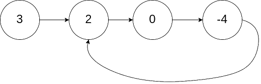
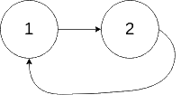

## [Linked List Cycle II](https://leetcode.com/problems/linked-list-cycle-ii/)

Given the `head` of a linked list, return the node where the cycle begins. If there is no cycle, return `null`.

There is a cycle in a linked list if there is some node in the list that can be reached again by continuously following the next pointer. Internally, pos is used to denote the index of the node that tail's `next` pointer is connected to (0-indexed). It is `-1` if there is no cycle. Note that `pos` is not passed as a parameter.

Do not modify the linked list.

### Example 1:

**Input**: `head = [3,2,0,-4]`, `pos = 1` 
**Output**: `0` 
**Explanation**: There is a cycle in the linked list, where tail connects to the second node.

### Example 2:

**Input**: `head = [1,2]`, `pos = 0` 
**Output**: `0` 
**Explanation**: There is a cycle in the linked list, where tail connects to the first node.

### Example 3:

**Input**: `head = [1]`, `pos = -1` 
**Output**: `null` 
**Explanation**: There is no cycle in the linked list.

### Constraints:

* The number of the nodes in the list is in the range `[0, 10^4]`
* `10^5 <= Node.val <= 10^5`
* `pos` is -1 or a valid index in the linked-list.

### Follow-up:

Can you solve it using `O(1)` (i.e. constant) memory?
