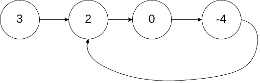

## [Linked List Cycle](https://leetcode.com/problems/linked-list-cycle/)

Given `head`, the head of a linked list, determine if the linked list has a cycle in it.

There is a cycle in a linked list if there is some node in the list that can be reached again by continuously following the `next` pointer. Internally, `pos` is used to denote the index of the node that tail's `next` pointer is connected to. Note that pos is not passed as a parameter.

Return `true` if there is a cycle in the linked list. Otherwise, return `false`.

### Example 1:

**Input**: `head = [3,2,0,-4]`, `pos = 1` 
**Output**: `true` 
**Explanation**: There is a cycle in the linked list, where the tail connects to the 1st node (0-indexed).

### Example 2:

**Input**: `head = [1,2]`, `pos = 0` 
**Output**: `true` 
**Explanation**: here is a cycle in the linked list, where the tail connects to the 0th node.

### Example 3:

**Input**: `head = [1]`, `pos = -1` 
**Output**: `false` 
**Explanation**: There is no cycle in the linked list.

### Constraints:

* The number of the nodes in the list is in the range `[0, 10^4]`
* `10^5 <= Node.val <= 10^5`
* `pos` is -1 or a valid index in the linked-list.

### Follow-up:

Can you solve it using `O(1)` (i.e. constant) memory?
