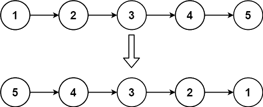
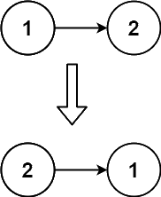

## [Reverse Linked List](https://leetcode.com/problems/reverse-linked-list/)

Given the `head` of a singly linked list, reverse the list, and return the reversed list.

### Example 1:

**Input**: `head = [1,2,3,4,5]` 
**Output**: `[5,4,3,2,1]` 

### Example 2:

**Input**: `head = [1,2]` 
**Output**: `[2,1]` 

### Example 3:

**Input**: `head = []` 
**Output**: `[]` 

### Constraints:

* The number of nodes in the list is the range `[0, 5000]`
* `-5000 <= Node.val <= 5000`

### Follow-up:

A linked list can be reversed either iteratively or recursively. Could you implement both?
