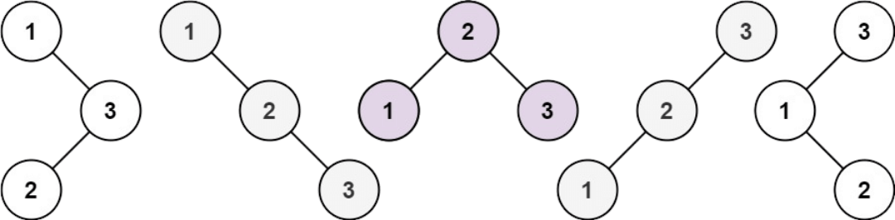

## Unique Binary Search Trees

Given an integer `n`, return all the structurally unique BST's (binary search trees), which has exactly `n` nodes of unique values from `1` to `n`. Return the answer in any order.

### Example 1:


**Input**: `n = 3`<br />
**Output**:
```
[
    [1,null,2,null,3],
    [1,null,3,2],
    [2,1,3],
    [3,1,null,null,2],
    [3,2,null,1]
]
```
### Example 2:

**Input**: `n = 1`<br />
**Output**:
```
[
    [1]
]
```

### Constraints:

* `1 <= n <= 8`

### Hint:

**Tags**: [Catalan number](https://en.wikipedia.org/wiki/Catalan_number)
