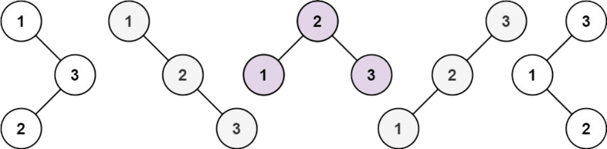

## Unique Binary Search Trees

Given an integer `n`, return the number of structurally unique BST's (binary search trees) which has exactly `n` nodes of unique values from `1` to `n`.

### Example 1:

**Input**: `n = 3` 
**Output**: `5`

### Example 2:

**Input**: `n = 1` 
**Output**: `1`

### Constraints:

* `1 <= n <= 19`

### Hint:

**Tags**: [Catalan number](https://en.wikipedia.org/wiki/Catalan_number)
